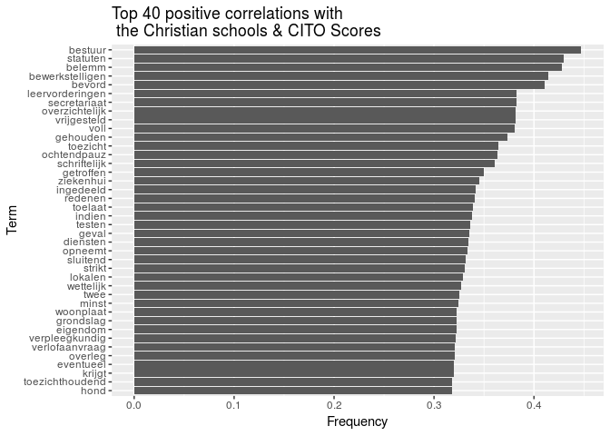
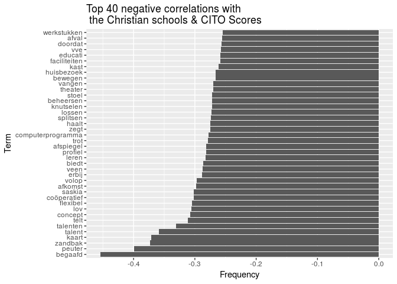

Finding correlations between textual terms and CITO scores
================

Loading the necessary libraries:

``` r
library(tm)
```

    ## Loading required package: NLP

``` r
library(SnowballC)
library(stringr)
library(ggplot2)
```

    ## 
    ## Attaching package: 'ggplot2'

    ## The following object is masked from 'package:NLP':
    ## 
    ##     annotate

RQ: What are the most commonly used words & the term frequencies in the *'Protestants-Christelijk'* schools and *'Rooms-Katholiek'* schools?

Read in our school metadata.

``` r
schools <- read.csv("../schools.csv",
                    sep = ";",
                    stringsAsFactors = FALSE)
```

PDF corpus.

``` r
gids <- readRDS("schoolgids2017v1_100.rds")
gids_id <- substring(names(gids), 1, 6)
```

Document pre-processing.

``` r
TurnSpace <- content_transformer(function(x, pattern) {return (gsub(pattern, " ", x))})
gids <- tm_map(gids, TurnSpace, "/|”|@|//|$|:|:)|*|&|!|?|_|-|‐|•|·|#|…+")

gids <- tm_map(gids, content_transformer(tolower))
gids <- tm_map(gids, stripWhitespace)
gids <- tm_map(gids, removePunctuation)
gids <- tm_map(gids, function(x) stemDocument(x, language = "dutch"))
gids <- tm_map(gids, removeNumbers)
gids <- tm_map(gids, removeWords, tm::stopwords("dutch"))
```

Create a DocumentTermMatrix.

``` r
dtm <- DocumentTermMatrix(gids)
sparse_dtm <- as.matrix(removeSparseTerms(dtm, sparse = 0.90))
```

Match the gids to rows in our schools table.

``` r
gids_row <- match(gids_id, schools$VESTIGINGSNUMMER)
gids_denominatie <- schools$DENOMINATIE[gids_row]
```

Normalize by frequency per 1000 words.

``` r
ndtm <- sparse_dtm / rowSums(sparse_dtm) * 1000
empty <- rowSums(sparse_dtm) == 0
```

Adding CITO scores.

``` r
cito <- read.csv("https://www.duo.nl/open_onderwijsdata/images/05.-gemiddelde-eindtoetsscores-2016-2017.csv", sep=";", header=TRUE, dec=",")
```

Adding a new column to the cito data frame.

``` r
cito$VN <- sprintf("%s%02d", cito$BRIN_NUMMER, cito$VESTIGINGSNUMMER)
```

Manipulation and scores.

``` r
gids_cito <- cito[cito$VN %in% gids_id & cito$CET_AANTAL > 0, c("VN", "CET_GEM") ]
gids_row <- match(gids_id, gids_cito$VN)
gids_score <- gids_cito$CET_GEM[gids_row]
```

Compute a correlation matrix between our dummy variable and the term frequency.

``` r
cor_matrix <- cor(gids_score[!empty], ndtm[!empty, ], use = "complete.obs")
```

    ## Warning in cor(gids_score[!empty], ndtm[!empty, ], use = "complete.obs"):
    ## the standard deviation is zero

Transpose and add as a data frame.

``` r
cor_df <- data.frame(term = colnames(cor_matrix), cor = cor_matrix[1,], 
                     row.names = NULL, stringsAsFactors = FALSE)
```

Order by absolute correlation.

``` r
cor_df <- cor_df[ order(-abs(cor_df$cor)), ]
```

Taking the first 40 positive correlations.

``` r
pos_cor <- cor_df[ cor_df$cor > 0, ][1:40, ]
```

Taking the first 40 negative correlations.

``` r
neg_cor <- cor_df[ cor_df$cor < 0, ][1:40, ]
```

Visualizations
--------------

``` r
ggplot(pos_cor, aes(reorder(term, cor), cor)) +
  geom_col() +
  coord_flip() +
  xlab("Term") + 
  ylab("Frequency") +
  ggtitle("Top 40 positive correlations with \n the Christian schools & CITO Scores")
```



``` r
ggplot(neg_cor, aes(reorder(term, cor), cor)) +
  geom_col() +
  coord_flip() +
  xlab("Term") + 
  ylab("Frequency") +
  ggtitle("Top 40 negative correlations with \n the Christian schools & CITO Scores")
```


