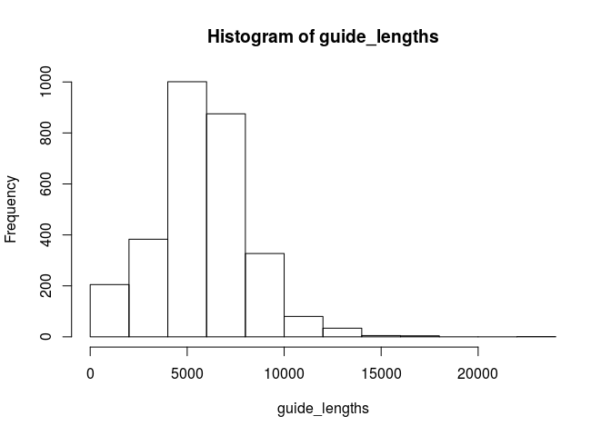

Document-Term Matrices
================

Load the data
-------------

We have a document term matrix pre-computed that we can load.

``` r
library(tm)
```

    ## Loading required package: NLP

``` r
(corpus <- readRDS("schoolgids2017v2.rds"))
```

    ## <<VCorpus>>
    ## Metadata:  corpus specific: 0, document level (indexed): 31
    ## Content:  documents: 2915

Define a tokenizer function
---------------------------

The tokenizer splits up our text documents into a list of words. The school guides contain quite a bit of special characters that are artifacts from the layout. We want to aggressively eliminate this, as well as URLs, websites, and email addresses.

``` r
tokenize_guide <- function(text) {
    # To lowercase 
    text <- tolower(text)
  
    # Remove web addresses
    text <- gsub(text, pattern="https?://\\S+", replacement = " ")
    text <- gsub(text, pattern="www\\.\\S+", replacement = " ")
    
    # Remove e-mail addresses
    text <- gsub(text, pattern="\\S+@\\S+", replacement = " ")
    
    # Remove non-UTF characters
    text <- iconv(text, "UTF-8", "latin1", sub = " ")

    # Remove all non alpha characters and collapse whitespace
    text <- gsub(text, pattern="[^[:alpha:]]+", replacement = " ")

    unlist(strsplit(as.character(text), split = "[^[:alpha:]]+"))
}
```

We can test our tokenizer on lines from a sampling of PDF text:

``` r
tokenize_guide("e-mail: oosterboerschool@stichtingpromes.nl website: www.oosterboerschool.nl
Denominatie: OPENBAAR DALTONONDERWIJS
Directie Oosterboerschool")
```

    ## [1] "e"                "mail"             "website"         
    ## [4] "denominatie"      "openbaar"         "daltononderwijs" 
    ## [7] "directie"         "oosterboerschool"

``` r
tokenize_guide("Er is een verschil tussen ‘samen werken’ en ‘samenwerken’")
```

    ## [1] "er"          "is"          "een"         "verschil"    "tussen"     
    ## [6] "samen"       "werken"      "en"          "samenwerken"

Construct the matrix
--------------------

``` r
(dtm <- DocumentTermMatrix(corpus, control = list(tokenize = tokenize_guide,
                                                       language = "nl",
                                                       removeNumbers = TRUE,
                                                       stopwords = TRUE,
                                                       stemming = TRUE,
                                                       wordLengths = c(4, Inf))))
```

    ## <<DocumentTermMatrix (documents: 2915, terms: 150493)>>
    ## Non-/sparse entries: 5566245/433120850
    ## Sparsity           : 99%
    ## Maximal term length: 74
    ## Weighting          : term frequency (tf)

``` r
saveRDS(dtm, "schoolgids2017v2_dtm_v3.rds")
```

The resulting matrix has documents in rows, and terms in columns.

Reduce to dense matrix
----------------------

The sparse Document-term matrix includes over a hundred thousand terms, most of which occur in a small number of documents.

``` r
ddtm <- as.matrix(removeSparseTerms(dtm, sparse = 0.95))

dim(ddtm)
```

    ## [1] 2915 5779

Normalize the term counts
-------------------------

Right now, our dense matrix contians the number of times each word appears in each school guide. We are interested in which words occur more frequency in which schools guides. However, some school guides are much longer than others.

``` r
guide_lengths <- rowSums(ddtm)

hist(guide_lengths)
```



Most school guides are around 5000 words, but there are several hundred that are nearly 10,000 words, and a long tail of guide with 15,000 to 20,000 words.

But first we need to remove a few school guides that don't have any words:

``` r
empty <- guide_lengths == 0
head(meta(corpus[empty], "pdf.url"))
```

    ##                                                                                                    pdf.url
    ## 51                      http://gbskoninginbeatrix.nl/wp-content/uploads/2016/03/Schoolgids-2017-2018-1.pdf
    ## 100                                        http://www.sintagnes.nl/uploads/documenten/schoolgids 17-18.pdf
    ## 147                    https://schalm.kerobei.nl/content/Schalm/team/2017-2018_Schoolgids_voor_website.pdf
    ## 162                                            http://www.hetpalet.nl/bestanden/453993/schoolgids_1718.pdf
    ## 637 https://www.debontemol.nl/content/26350/download/clnt/75889_Schoolgids_06TD_De_Bonte_Mol_2017-2018.pdf
    ## 670                                https://www.annamolenschot.nl/attachments/article/5/schoolgids17-18.pdf

A quick check of the PDFs suggests that these PDFs contain scanned images without text.

Finally, we can normalize the matrix by dividing each row by the total number of documents in that row.

``` r
ndtm <- ddtm[!empty, ] / guide_lengths[!empty] * 10000

saveRDS(ndtm, "schoolgids2017v2_ndtm_v3.rds")
```
