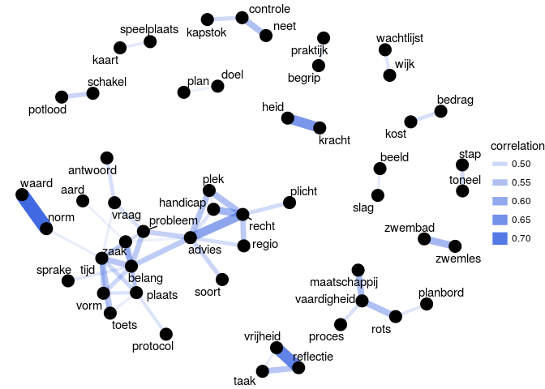
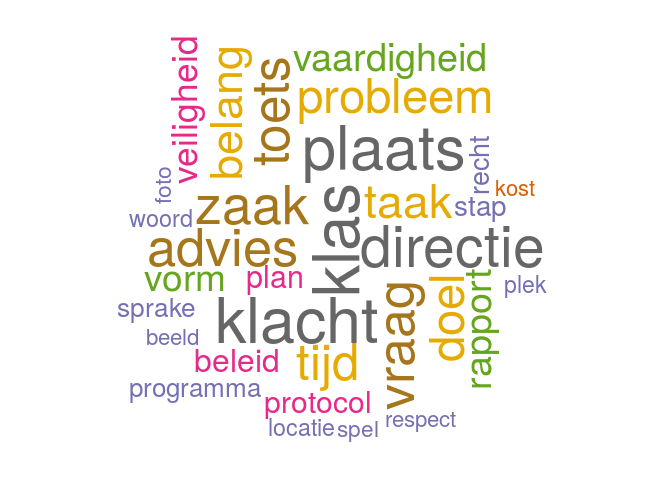

Word pairwise correlations, network graph and wordcloud from the schoolgids
================

``` r
library(tidyverse)
library(magrittr)
library(tidytext)
#library(tidyr)
library(widyr)
library(scales)
library(ggplot2)
library(igraph)
library(ggraph)
```

The data is from the frogged (NLP) data (with 200 samples).

``` r
datafile <- "schoolgids2017v4_frogged_200.rds"
if(!file.exists(datafile)) {
  download.file("https://storage.googleapis.com/schoolgids/schoolgids2017v4/schoolgids2017v4_frogged_200.rds", datafile)
}
tokens <- readRDS(datafile)
head(tokens)
```

    ##   school sent position              word             lemma  pos ner_index
    ## 1 16JK00    1        2                 1                 1   TW        NA
    ## 2 16JK00    1        3              1502              1502   TW        NA
    ## 3 16JK00    1        4        ND_Zaandam        ND_Zaandam SPEC         1
    ## 4 16JK00    1        5            E-mail            e-mail    N        NA
    ## 5 16JK00    1        6                 :                 :  LET        NA
    ## 6 16JK00    1        7 info@saenparel.nl info@saenparel.nl SPEC        NA
    ##   ner_type chunk_index chunk_type
    ## 1     <NA>           2         NP
    ## 2     <NA>           3         NP
    ## 3      ORG           4         NP
    ## 4     <NA>           5         NP
    ## 5     <NA>          NA       <NA>
    ## 6     <NA>           6         NP

Our (frogged) corpus only with nouns (in the POS model).

``` r
tokens_nouns <- tokens[tokens$pos == "N", c("school", "lemma")]
stop_nouns <- c("kind", "school", "groep", "leerling", "ouder", "onderwijs", "leerkracht", "jaar", "schooljaar", "informatie", "activiteit", "ondersteuning", "basisschool", "gesprek", "week", "contact", "directeur", "website", "e-mail", "afspraak", "team", tm::stopwords("dutch") )
tokens_nouns_stop <- tokens_nouns[!grepl(paste(stop_nouns, collapse="|"), tokens_nouns$lemma),]
tokens_nouns_stop <- tokens_nouns_stop[(which(nchar(tokens_nouns_stop$lemma) >= 4)), ] # words less than or equal to 'n' char
```

Calculating the correlations of pairs of items. Word co-occurances and correlations. The `widyr` package is nice to count common pairs of words co-appearing.

``` r
word_cors <- tokens_nouns_stop %>%
  group_by(lemma) %>%
  filter(n() >= 50) %>%
  pairwise_cor(lemma, school, sort = TRUE, upper = FALSE)
head(word_cors)
```

    ## # A tibble: 6 x 3
    ##   item1    item2     correlation
    ##   <chr>    <chr>           <dbl>
    ## 1 waard    norm            0.733
    ## 2 vrijheid reflectie       0.679
    ## 3 kracht   heid            0.638
    ## 4 recht    advies          0.607
    ## 5 recht    handicap        0.573
    ## 6 zwemles  zwembad         0.569

Network of which words commonly occur together.

``` r
set.seed(1234)
word_cors %>%
  filter(correlation > .45) %>%
  graph_from_data_frame() %>%
  ggraph(layout = "fr") +
  geom_edge_link(aes(edge_alpha = correlation, edge_width = correlation), edge_colour = "royalblue") +
  geom_node_point(size = 5) +
  geom_node_text(aes(label = name), repel = TRUE,
                 point.padding = unit(0.2, "lines")) +
  theme_void()
```



Do you spot any *intruder* word & correlation?

We generate the word clouds that appear more frequently in the lemma text.

``` r
library(wordcloud)
```

    ## Loading required package: RColorBrewer

``` r
library(RColorBrewer)

wc <- aggregate(Freq ~ Var1, data = as.data.frame(table(tokens_nouns_stop$lemma)), FUN = sum)
wc <- wc[order(wc$Freq, decreasing = TRUE),]

set.seed(1234)
wordcloud(words = wc$Var1, freq = wc$Freq, min.freq = 550,
          max.words=200, random.order=FALSE, rot.per=0.35, 
          colors=brewer.pal(8, "Dark2"))
```


