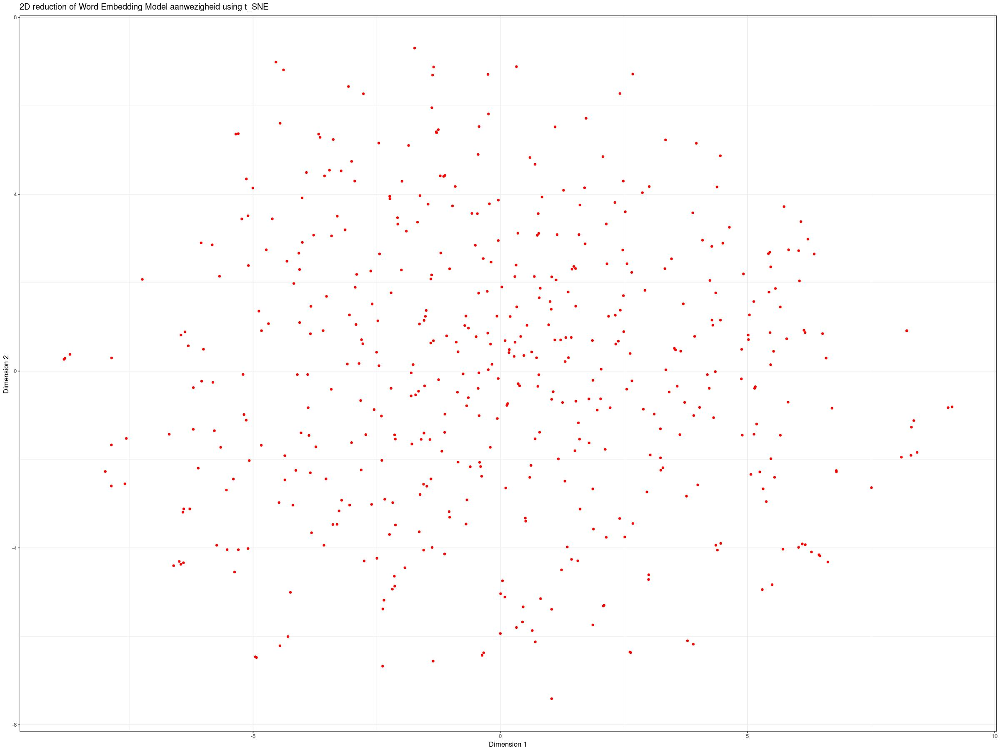

# Introduction

1. Embedding words with word2vec
2. Classify with t-SNE
3. Visualize with ggplot2

Install the needed libraries.
```{r, message=FALSE}
library(wordVectors)
library(Rtsne)
library(ggplot2)
library(ggrepel)
```

Importing our data (with 500 words).
```{r, message=FALSE}
datafile <- "schoolgids2017v4_500.rds"
if(!file.exists(datafile)) {
  download.file("https://storage.cloud.google.com/schoolgids/schoolgids2017v4/schoolgids2017v4_500.rds", datafile)
}
corpus <- readRDS(datafile)
```

Preparing the text to get only the content. Computation time is a bit much, so we take 200 samples from the dataset.

Optionally, you can do some post-processing in order to obtain more accurate results such as remove punctuation, convert to lower case, remove stopwords. Stopwords can be tailored by the analyst.
```{r}
set.seed(1037)
text <- sapply(sample(1L:length(corpus$content), 200), function(i) corpus$content[[i]]$content)
text_collapse <- unlist(text)
```

# Train the model

Create the model and write to a file. If a model has previously been created and saved, it can be loaded using `read.vectors()`.
```{r, message=FALSE, results='hide'}
textfile <- "text_collapse.txt"
if(!file.exists(textfile)) {
  writeLines(text_collapse, textfile)
}

modelfile <- "text_collapse_model.bin"
if(!file.exists(modelfile)) {
  train_word2vec(textfile,
                 output = modelfile, threads = 1,
                 vectors = 100, window = 12)  
}
model <- read.vectors(modelfile)
```

If we want to see the ten terms in the model which are closest to the term. The measure of similarity is calculated by using Cosine similarity (basically the angle between the vectors).

Top 10 closest terms to the word 'aanwezigheid'. Interesting results, huh?
```{r}
closest_to(model, "leerkracht", n = 10)
```

# Plotting the Closest terms

* **Rtsne** package (t-distributed Stochastic Neighbour Embedding) to reduce the dimensions to two. 

Identify the closest 500 words to the average vector of search terms.
```{r}
word <- "aanwezigheid"
main <- closest_to(model, model[[word]], 500)
wordlist <- main$word
```

Create a subset vector space model.
```{r}
new_model <- model[[wordlist, average = FALSE]]
head(new_model)
```

Run Rtsne to reduce new Word Embedding Model to 2D
```{r}
reduction <- Rtsne(as.matrix(new_model), dims = 2, initial_dims = 50,
                   perplexity = 30, theta = 0.5, check_duplicates = F,
                   pca = F, max_iter = 1000, verbose = F,
                   is_distance = F, Y_init = NULL)
```

Extract Y (positions for plot) as a dataframe and add row names
```{r}
df <- as.data.frame(reduction$Y)
rows <- rownames(new_model)
rownames(df) <- rows
```

Create t-SNE plot and save as jpeg.
```{r, eval=FALSE}
ggplot(df) +
  geom_point(aes(x = V1, y = V2), color = "red") +
  #geom_text_repel(aes(x = V1, y = V2, label = rownames(df))) +
  xlab("Dimension 1") +
  ylab("Dimension 2 ") +
  theme_bw(base_size = 12) +
  theme(legend.position = "none") +
  ggtitle(paste0("2D reduction of Word Embedding Model ", word," using t_SNE"))
ggsave(paste0(word, ".jpeg"), width = 24, height = 18, dpi = 100)
```





# References
 
Kerr, S. (2017). *Getting Started With Word Embedding in R.* http://programminghistorian.github.io/ph-submissions/lessons/getting-started-with-word-embeddings-in-r

TensorFlow. *Vector Representations of Words.* Retrieved from https://www.tensorflow.org/tutorials/word2vec

Falbel, D. (2017) *Word Embeddings with Keras.* RStudio Blog. https://tensorflow.rstudio.com/blog/word-embeddings-with-keras.html